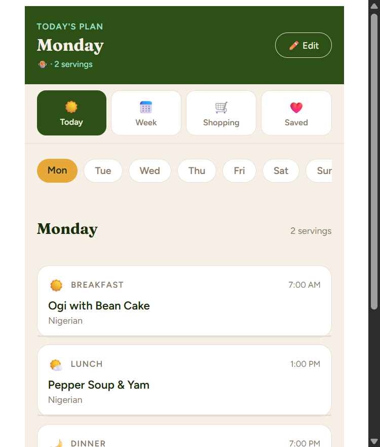
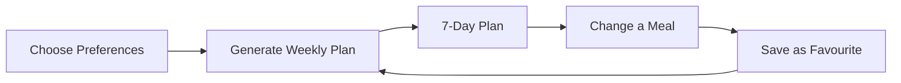
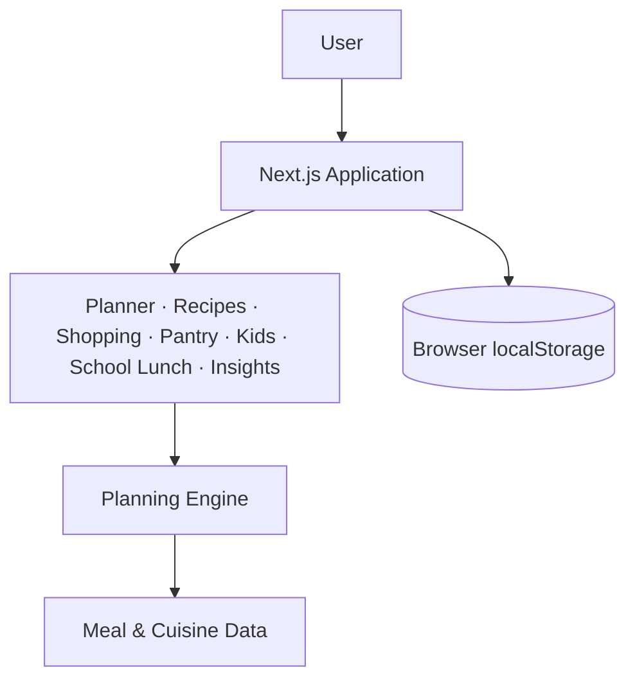

<div align="center">

# 🍲 Chop Chop

### A Nigerian-first meal planning experience

**Plan your week. Discover what to cook. Shop with less stress.**

<br />

[](https://nextjs.org/)
[](https://react.dev/)
[](https://www.typescriptlang.org/)
[](https://vercel.com/)

<br />

[**View Demo**](#) · [**View Architecture**](#architecture) · [**View Source**](https://github.com/Daniel-Sunday/Meal-planner)

</div>

<br />

<p align="center">
  
</p>

<br />

## What is Chop Chop?

Chop Chop is a mobile-first meal planning app built around the realities of Nigerian and West African households. It helps people move from *"what are we cooking today?"* to a structured weekly plan built from meals and cuisines they actually enjoy — covering breakfast, lunch, and dinner, with favourites saved and turned into a shopping list.

## The Problem

Meal planning isn't hard because people don't know enough recipes — it's hard because the decision repeats every single day: what to cook, what everyone likes, what was cooked recently, what's in stock, what to buy. Chop Chop replaces that daily loop with a reusable weekly plan, so the product helps people **decide**, not just search for another recipe.

## Product Goals

| Principle | Goal |
|---|---|
| Personal | Plans reflect what the household actually enjoys |
| Practical | The plan leads naturally into a shopping list |
| Simple | Planning requires as few decisions as possible |
| Familiar | Nigerian and African meals are first-class, not an afterthought |

## Core Features

| | |
|---|---|
| 🗓️ **Weekly Planning** | Generates a full 7-day plan across breakfast, lunch, and dinner |
| ❤️ **Favourites** | Saved meals feed back into future plans |
| 🇳🇬 **Nigerian & African Meals** | Built around familiar regional cuisine, not a generic recipe catalogue |
| 🛒 **Dynamic Shopping** | Shopping list generated automatically from the current plan |
| 📱 **Mobile-First** | Touch-friendly, compact, fast to navigate |
| 📲 **WhatsApp Sharing** | Share a plan through the channel people already use |

## How It Works



The core loop is **choose → plan → cook → save what you love → improve the next plan.**

### Planning Engine

Selection isn't random. When a favourite applies to a slot, the engine weights it in **60% of the time**, and never repeats the same meal in the same slot consecutively — balancing personalization against variety.

## Architecture

Chop Chop is built on the Next.js App Router, organized around product domains rather than a single monolithic page.



| Domain | Responsibility |
|---|---|
| `onboarding` | Collect meal and cuisine preferences |
| `planner` | Generate and display weekly plans |
| `recipes` | Meal and recipe experiences |
| `shopping` | Generate shopping requirements |
| `pantry` | Pantry-related planning |
| `kids` / `school-lunch` | Family and school meal planning |
| `insights` | Planning insights |
| `engines` | Planning and selection logic |
| `data` | Meal and application data |

### Project Structure

```
Meal-planner/
├── public/
├── src/
│   ├── app/
│   │   ├── blog/  data/  engines/  insights/  kids/
│   │   ├── onboarding/  pantry/  planner/  recipes/
│   │   ├── school-lunch/  shopping/
│   │   ├── home-client.tsx  layout.tsx  page.tsx  utils.ts
│   ├── assets/
│   └── components/
├── current_state.png
├── next.config.js
└── package.json
```

### Data & Persistence

The current version intentionally uses **browser localStorage** instead of a backend, keeping the app lightweight and account-free. Persisted keys: `mealplanner_favourites`, `mealplanner_selected`, `mealplanner_servings`, `mealplanner_plan`.

This is a deliberate trade-off — data is tied to the device/browser, with no cloud sync yet. That's the first thing the roadmap below addresses.

## Design System

The visual direction is **warm, premium, familiar, African, home-oriented** — closer to a digital kitchen companion than a productivity dashboard. Fraunces for display headings, Figtree for interface text; warm cream backgrounds, forest green primary surfaces, terracotta actions, rounded touch-friendly components.

## Technology Stack

| Layer | Technology |
|---|---|
| Framework | Next.js 15 (App Router) |
| UI | React 18, TypeScript |
| Persistence | Browser localStorage |
| Typography | Fraunces + Figtree |
| Linting | ESLint |
| Deployment Target | Vercel |

## Getting Started

**Prerequisites:** Node.js 18.18+, npm, Git

```bash
git clone https://github.com/Daniel-Sunday/Meal-planner.git
cd Meal-planner
npm install
npm run dev
```

Visit [http://localhost:3000](http://localhost:3000).

| Command | Description |
|---|---|
| `npm run dev` | Start development server |
| `npm run build` | Create production build |
| `npm run start` | Start production server |
| `npm run lint` | Run ESLint |

## Product Status

**Implemented:** splash screen · cuisine picker · 7-day meal generation · daily/weekly views · shopping list · favourites · WhatsApp sharing · mobile-first design system.

**In progress / planned:** ₦ budget estimation, cloud persistence, user accounts, cross-device sync, pantry-aware planning, family preferences, expanded African cuisines.

## Roadmap

- **Personalization** — household profiles, family preferences, meal history, smarter repetition control
- **Planning** — budget estimation, pantry-aware planning, ingredient availability
- **Infrastructure** — authentication, cloud persistence, cross-device sync, backend data layer
- **Expansion** — more Nigerian and African regional cuisines, deeper family and school-lunch planning

The current local-first architecture is intentionally simple — no backend, no auth, no ML — and is designed to grow into a cloud-backed household food system as those needs arrive, without a rewrite.

<br />

<div align="center">

🍲 **Pick your favourites. Plan your week. Cook with less stress.**

Built by [Daniel Sunday](https://github.com/Daniel-Sunday)

</div>
